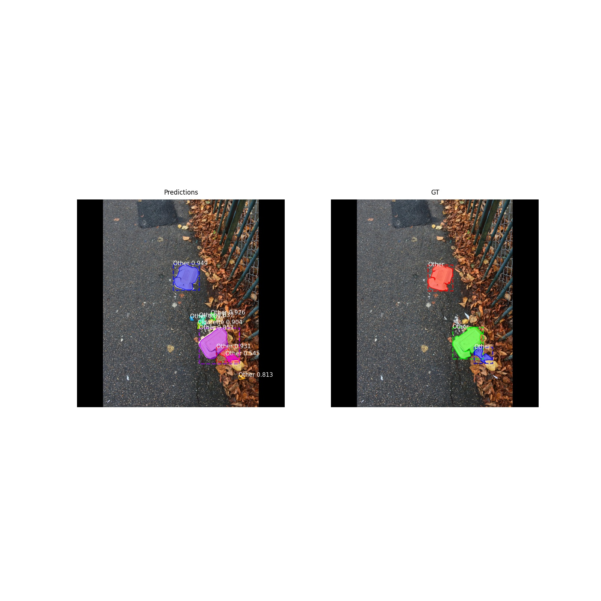
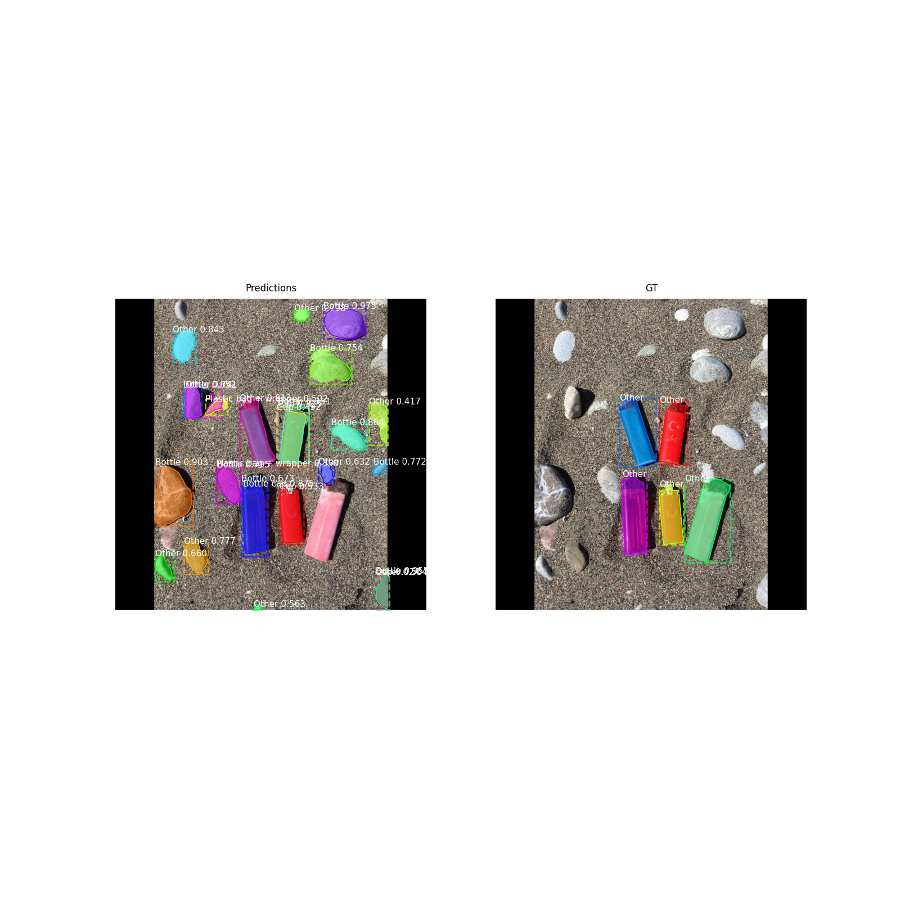
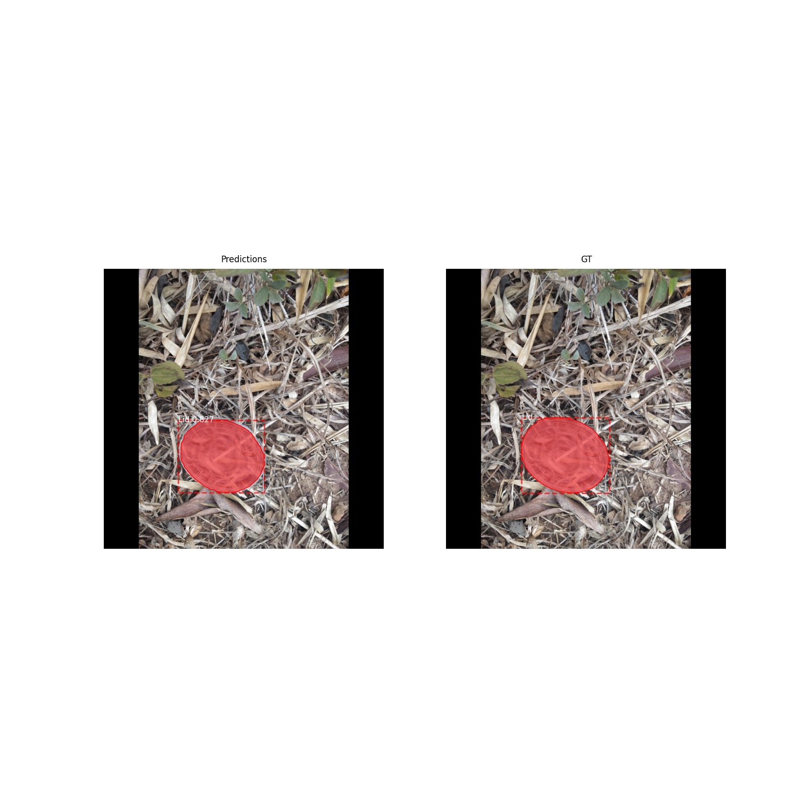

# Trash_Segmentation_TACO
Trash Segmentation from TACO dataset using MASK-RCNN

This repo contains the code for training and testing MASK-RCNN on the TACO dataset.

    
     
    <em>Sample1</em>

    
     
    <em>Sample2</em>

    
     
    <em>Sample3</em>

